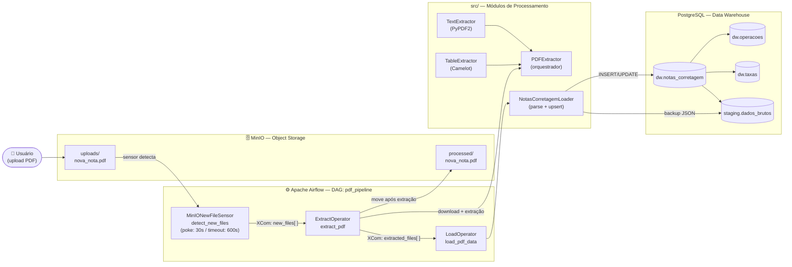

O **PDF Pipeline** resolve um problema real: notas de corretagem chegam como PDFs não estruturados. Extrair, organizar e armazenar esses dados manualmente é trabalhoso e propenso a erros.

Este projeto automatiza completamente esse processo:

1. O usuário faz upload do PDF para um bucket MinIO
2. O Airflow detecta o arquivo, extrai texto e tabelas
3. Os dados são parseados e persistidos em um Data Warehouse PostgreSQL
4. O PDF é marcado como processado e movido automaticamente

O sistema é **contínuo**, **idempotente** e **tolerante a falhas** — o Airflow reprocessa automaticamente em caso de erro, sem criar duplicatas no banco.

---

#### Stack Tecnológica

| Camada | Tecnologia | Papel |
|---|---|---|
| Orquestração | Apache Airflow 2.9+ | Gerencia execução, retries e dependências entre tarefas |
| Object Storage | MinIO (S3-compatible) | Recebe PDFs via upload e armazena processados |
| Banco de Dados | PostgreSQL | Data Warehouse estruturado (schema **dw** + **staging**) |
| Extração de Texto | PyPDF2 | Lê conteúdo textual página a página |
| Extração de Tabelas | Camelot | Detecta e extrai tabelas (lattice → stream fallback) |
| Conexão S3 | boto3 | Cliente AWS S3 adaptado para MinIO |
| Logging | Loguru | Logging estruturado com contexto em todos os módulos |
| Validação | Pydantic | Modelos de dados tipados |
| Testes | pytest + pytest-cov | Testes unitários com relatório de cobertura |
| Linting | ruff | Análise estática, formatação e verificação de imports |
| Gerenciador | uv | Gerenciamento de dependências e ambientes virtuais |
| Containers | Docker + Compose | Airflow (init + webserver + scheduler) + pgAdmin |

---

#### Arquitetura



---

#### Fluxo de Dados

#### Task 1 — **detect_new_files** (MinIONewFileSensor)

- Verifica a pasta `uploads/` do bucket a cada **30 segundos**
- Filtra apenas arquivos `.pdf` que não estejam em `processed/`
- Faz **XCom push** da lista `new_files[]` para a próxima task
- Timeout de 600s; retries configurados com backoff de 5 minutos

#### Task 2 — **extract_pdf** (ExtractOperator)

- Recebe a lista via **XCom pull** (**new_files[]**)
- Faz **download** do PDF do MinIO para **/tmp/pdf_pipeline/**
- Executa **PDFExtractor.extract()**:
  - **TextExtractor** → extrai texto de todas as páginas via PyPDF2
  - **TableExtractor** → tenta **lattice** primeiro; fallback para **stream**
- Serializa o resultado em **JSON intermediário** (**extracted**)
- Move o PDF de **uploads/** → **processed/** via **MinIOHook.move_object()**
- Faz **XCom push** da lista **extracted_files[]**

#### Task 3 — **load_pdf_data** (LoadOperator)

- Recebe a lista via **XCom pull** (**extracted_files[]**)
- Lê o JSON intermediário e instancia **NotasCorretagemLoader**
- Parseia o conteúdo textual via **regex** para extrair:
  - Dados da nota: cliente, corretora, conta, número, data de pregão
  - Operações: código do ativo, tipo (C/V), quantidade, cotação
  - Taxas: IRRF, ajuste, corretagem, registro
- Verifica **idempotência** (**_check_nota_exists**) antes de inserir
- Executa **UPSERT** nas tabelas do schema **dw**
- Salva backup bruto em **staging.dados_brutos** (JSONB)
- Comita a transação e fecha a conexão

---

### Estrutura do Projeto

```
projeto-pdf-pipeline/
├── config/
│   ├── docker-compose.yaml       # Airflow init + webserver + scheduler + pgAdmin
│   └── .env.example              # Template de variáveis de ambiente
│
├── dags/
│   ├── pdf_pipeline_dag.py       # DAG principal (schedule: */2 * * * *)
│   ├── hooks/
│   │   ├── minio_hook.py         # boto3 wrapper para MinIO
│   │   └── postgres_hook.py      # psycopg2 wrapper para PostgreSQL
│   ├── operators/
│   │   ├── extract_operator.py   # Download + extração + move
│   │   └── load_operator.py      # Parse + upsert PostgreSQL
│   └── sensors/
│       └── minio_sensor.py       # BaseSensorOperator — detecta PDFs novos
│
├── src/
│   ├── extractors/
│   │   ├── pdf_extractor.py      # Facade: combina texto + tabelas
│   │   ├── text_extractor.py     # PyPDF2 — extração página a página
│   │   └── table_extractor.py    # Camelot — lattice com fallback stream
│   ├── loaders/
│   │   └── notas_corretagem_loader.py  # Parser regex + UPSERT idempotente
│   └── utils/
│       └── logging_config.py     # Loguru — logging estruturado
│
├── sql/
│   └── notas_corretagem.sql      # Schemas dw + staging com índices
│
├── tests/
│   ├── test_text_extractor.py
│   ├── test_table_extractor.py
│   ├── test_pdf_extractor.py
│   └── test_loader_insert.py
│
├── samples/                      # PDFs de exemplo para testes
├── scripts/                      # Utilitários de desenvolvimento
├── docs/                         # Diagramas de arquitetura
└── pyproject.toml                # Configuração uv + ruff + pytest
```

---

#### Schema do Banco de Dados

O banco utiliza dois schemas: **dw** (dados de negócio, prontos para análise) e **staging** (dados brutos para auditoria).

##### dw.notas_corretagem

Tabela principal com uma constraint **UNIQUE(corretora, conta_liquidacao, numero_fatura, data_pregao)** que garante **idempotência** — o mesmo PDF pode ser reprocessado sem gerar duplicatas.

| Coluna | Tipo | Descrição |
|---|---|---|
| **id** | SERIAL PK | Identificador único |
| **file_name** | VARCHAR | Nome do arquivo PDF |
| **corretora** | VARCHAR | Nome da corretora |
| **cliente** | VARCHAR | Nome do cliente |
| **conta_liquidacao** | VARCHAR | Conta de liquidação |
| **numero_fatura** | VARCHAR | Número da nota |
| **nota_numero** | INT | Número sequencial |
| **data_pregao** | DATE | Data do pregão (ISO 8601) |
| **status** | VARCHAR | **success** \| **error** |
| **upload_date** | TIMESTAMP | Data do upload original |
| **processed_date** | TIMESTAMP | Data do processamento |

##### **dw.operacoes**

| Coluna | Tipo | Descrição |
|---|---|---|
| **nota_id** | INT FK | Referência à nota |
| **operacao** | VARCHAR | **C** (compra) ou **V** (venda) |
| **mercadoria** | VARCHAR | Código do ativo (ex: **VALE3**, **PETR4**) |
| **tipo** | VARCHAR | Tipo de mercado |
| **vencimento** | DATE | Data de vencimento |
| **quantidade** | INT | Quantidade de contratos |
| **cotacao** | DECIMAL | Preço por contrato |
| **taxa_op** | DECIMAL | Taxa operacional |

##### **dw.taxas**

| Coluna | Tipo | Descrição |
|---|---|---|
| **nota_id** | INT FK | Referência à nota |
| **irrf** | DECIMAL | Imposto de Renda Retido na Fonte |
| **ajuste** | DECIMAL | Ajuste de custo |
| **taxa_corretagem** | DECIMAL | Taxa de corretagem |
| **taxa_registro** | DECIMAL | Taxa de registro/bolsa |

##### **staging.dados_brutos**

Backup do conteúdo bruto extraído para fins de auditoria e reprocessamento.

| Coluna | Tipo | Descrição |
|---|---|---|
| **nota_id** | INT FK | Referência à nota |
| **text_content** | TEXT | Texto completo extraído |
| **table_data** | JSONB | Tabelas extraídas em JSON |

---

### Desenvolvimento Local

#### Pré-requisitos

- Python 3.12+
- [uv](https://docs.astral.sh/uv/) (gerenciador de pacotes)
- Docker + Docker Compose

#### Setup

```bash
# Clonar o repositório
git clone https://github.com/IasmimHorrana/pdf-extract-pipeline
cd pdf-extract-pipeline

# Instalar dependências
uv sync

# Copiar variáveis de ambiente
cp config/.env.example config/.env
```

#### Subir a infraestrutura

```bash
# Iniciar Airflow + PostgreSQL + MinIO
docker compose -f config/docker-compose.yaml up -d

# Aguardar inicialização (~30s) e acessar:
# Airflow:    http://localhost:8081
# pgAdmin:    http://localhost:5051
# MinIO:      http://localhost:9001
```

#### Configurar conexões no Airflow

Acesse **Admin > Connections** e adicione:

- **minio_default** (tipo: HTTP) — host, porta e credenciais do MinIO
- **postgres_default** (tipo: Postgres) — host **weather_postgres**, banco **pdf_db**

#### Testar extração localmente

```bash
# Preview dos dados extraídos (sem inserir no banco)
uv run python scripts/preview_notas_loader.py

# Extração direta de um PDF
uv run python -c "
from src.extractors import PDFExtractor
result = PDFExtractor().extract('samples/Notas_Corretagem_Final-1.pdf')
print(f'Páginas: {result.total_pages} | Tabelas: {result.total_tables}')
"
```

#### Testes e qualidade de código

```bash
# Lint e formatação
uv run ruff check .
uv run ruff format .

# Testes com cobertura
uv run pytest tests/ --cov=src --cov-report=term-missing
```

---

### Por que MinIO e não pasta local?

MinIO simula a API S3 localmente, tornando o projeto compatível com ambientes de produção na nuvem (AWS S3, Google Cloud Storage) com zero mudança de código. A abstração via **MinIOHook** isola a implementação.

##### Por que dois schemas (**dw** e **staging**)?

O schema `dw` contém apenas dados validados e estruturados, prontos para análise em ferramentas como Metabase ou Power BI. O schema `staging` guarda os dados brutos como backup de auditoria, permitindo reprocessar qualquer nota sem precisar do PDF original.

##### Idempotência via constraint única

A constraint **UNIQUE(corretora, conta_liquidacao, numero_fatura, data_pregao)** garante que o Airflow pode fazer retry ilimitado de qualquer task sem risco de duplicar registros no banco. O loader faz **UPDATE** se a nota já existe, **INSERT** caso contrário.

---

#### Glossário

| Termo | Definição |
|---|---|
| **Nota de Corretagem** | Documento emitido pela corretora resumindo as operações do pregão |
| **Pregão** | Período de negociação na bolsa de valores |
| **IRRF** | Imposto de Renda Retido na Fonte sobre ganhos em renda variável |
| **Lattice** | Método Camelot para PDFs com tabelas de bordas visíveis |
| **Stream** | Método Camelot para PDFs com tabelas sem bordas (por espaçamento) |
| **Idempotência** | Propriedade de poder executar múltiplas vezes sem efeito colateral |
| **UPSERT** | Operação que insere ou atualiza dependendo da existência do registro |
| **XCom** | Mecanismo do Airflow para passar dados entre tasks de uma DAG |
| **DAG** | Directed Acyclic Graph — grafo de tarefas do Airflow |
| **Hook** | Abstração de conexão com sistema externo no Airflow |
| **Sensor** | Operador que aguarda uma condição antes de liberar a próxima task |